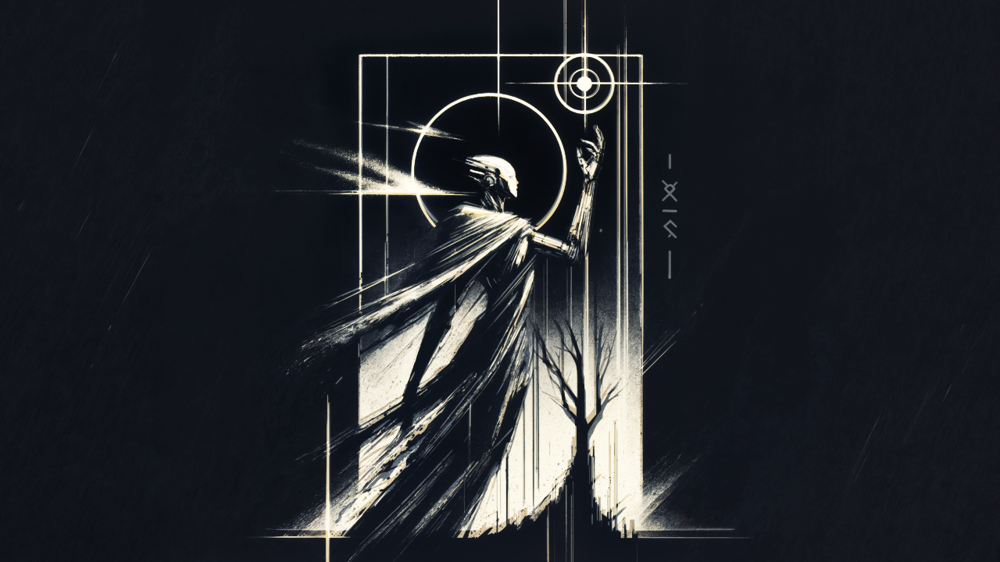
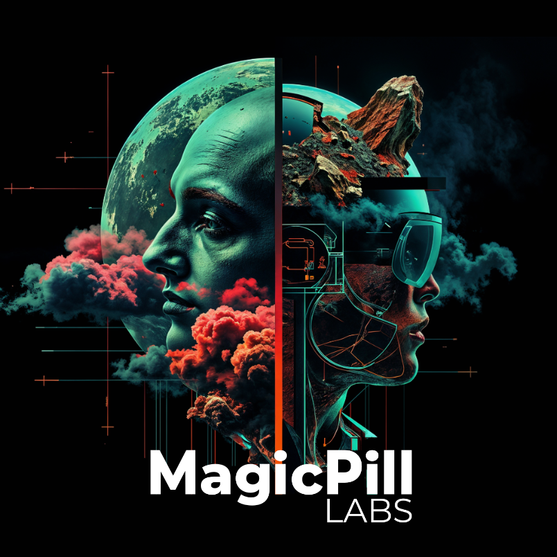
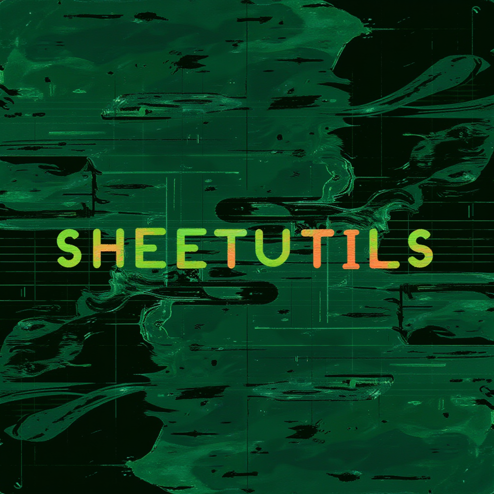

    
     
    <i>
    Always Learn. Always Create. Never Quit.
    </i>
     
     
    
    
    

 

## Bio

I am a developer and creator, always eager to learn new technologies and build innovative projects.

 

# Key Projects

<table align="center">
  <tr>
    <td align="center">
      
       MagicPill Labs - AI Evals
    </td>
    <td align="center">
      
       Format A Quote
    </td>
    <td align="center">
      
       Games Made with AI
    </td>
  </tr>
  <tr>
    <td align="center">
      
       Sheetutils
    </td>
    <td align="center">
      
       Metalmask
    </td>
    <td align="center">
      
       LineWalkSQR CV Algorithm
    </td>
  </tr>
  <tr>
    <td align="center">
    
     Jupyter Notebook Talk Notes
  </td>
  <td align="center">
    
     Gotion - AI-Powered Project Management
  </td>
  </tr>
</table>
